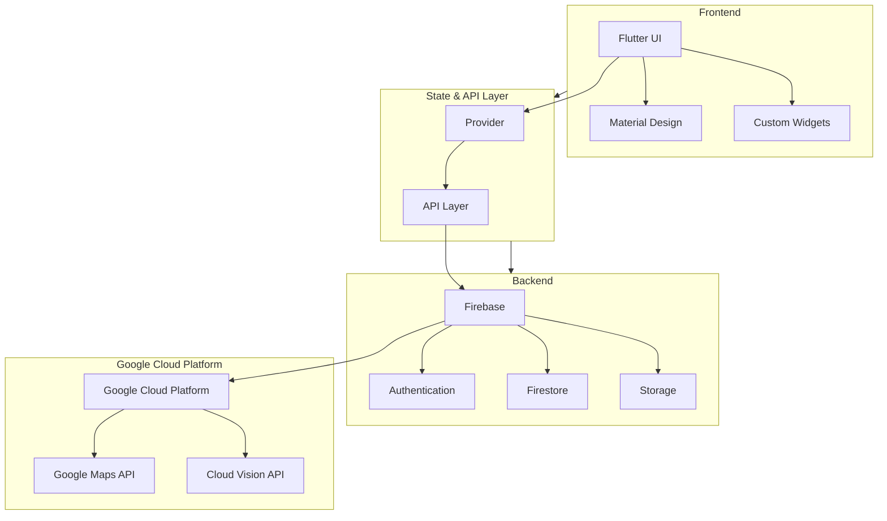

# Illumina: Designing Cities for People

**A computer vision-powered platform to light up our cities.**  
Empowering SDG 11 & 16 through real-time mapping, hazard reporting, and community-driven safety insights.

---

## Tech Stack

- **Flutter** (cross-platform: Android, iOS, Web)
- **Firebase** (Firestore, Storage, Auth)
- **Google Cloud Vision API**
- **Google Maps Platform**

---

### Architecture

<!-- Logos (optional, for visual appeal) -->
<p align="center">
  
  
  
</p>



---

## Deployment

### 🌐 **Try the Web App**
[project-illumina.netlify.app](https://project-illumina.netlify.app)  
*Just click and use!*

### 🖥️ **Run Locally (Flutter)**
1. Clone the repo and run:
   ```bash
   flutter pub get
   flutter run -d chrome # or -d android, -d ios
   ```

---

## About

Illumina is Phase 1 of the Design Cities for People Initiative (DCPI)—a civic tech project using computer vision and real-time data to make urban spaces safer and more accountable.

---

*Bigyan nating liwanag ang ating mga siyudad tungo sa makataong disenyo.*
